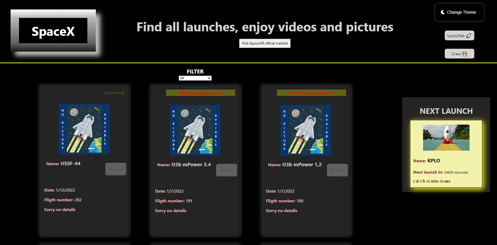

# Personnal project using SpaceX API with color theme switcher

## Table of contents

- [Overview](#overview)
  - [I challenged](#the-challenge)
  - [Screenshot](#screenshot)
  - [Links](#links)
- [My process](#my-process)
  - [Built with](#built-with)
  - [What I learned](#what-i-learned)
  - [Useful resources](#useful-resources)
- [Author](#author)
- [Learn More](#learn-more)

## Overview

### I challenged

Get from the API:

- Infos about all the launches
- Many possibilities to filter what you want to see
- Video opened in a ligthbox
- Next launch in a aside section with infos and countdown
- Open crew infos when mentionned
- See on one page all the crews

### Screenshot

### Links

- Solution URL: [Repository](https://github.com/LazezBZH/SpaceX)
- Live Site URL: [Deployment on Netlify](https://space-x-lazez.netlify.app/)

## My process

### Built with

- Semantic HTML5 markup
- CSS custom properties
- Flexbox
- [React](https://reactjs.org/) - JS library

### What I learned

I trained making API requests.
Problems met: API is not always update in time...I code messages asking visitor to be patient
all infos don't always exist, then had ti write several condition for my cards

### Useful resources

- [API](https://github.com/r-spacex/SpaceX-API)

## Author

- Website - [Bénédicte Hérault](https://lazez-bzh.netlify.app/)
- LinkedIn - [B. HÉRAULT](https://www.linkedin.com/in/benedicte-herault/)

### Learn More

You can learn more in the [Create React App documentation](https://facebook.github.io/create-react-app/docs/getting-started).

To learn React, check out the [React documentation](https://reactjs.org/).
